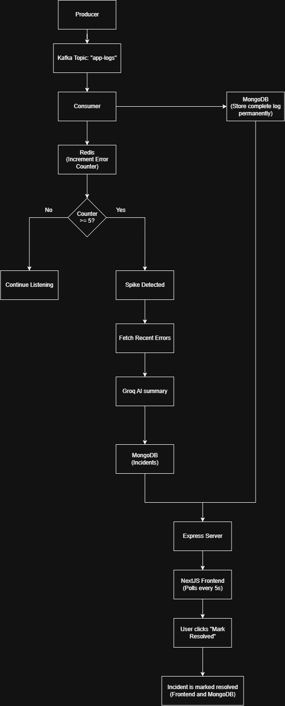

# LogSentinel

A real-time log monitoring system that detects error spikes and uses AI to generate a human-readable root-cause summary.

This project started as a way for me to learn Kafka and Redis beyond tutorials. Along the way, it grew into an end-to-end event-driven system that simulates how modern monitoring platforms process logs, detect incidents, and help engineers investigate problems faster.

---

## Architecture



---

## Features

- Real-time log ingestion using Kafka
- Error spike detection using Redis
- AI-generated root-cause summaries using Groq
- Permanent log and incident storage in MongoDB
- Incident management (mark incidents as resolved)
- Dashboard built with Next.js
- REST APIs built with Express
- End-to-end implementation in TypeScript

---

## Tech Stack

| Technology | Purpose |
|------------|---------|
| Kafka | Real-time event streaming |
| Redis | Error counting and spike detection |
| MongoDB | Log and incident storage |
| Express | Backend APIs |
| Next.js | Dashboard |
| TypeScript | Shared language across the project |
| Groq (GPT-OSS 120B) | AI-generated incident summaries |

---

## How it works

1. A producer simulates multiple backend services generating logs.
2. Logs are published to a Kafka topic.
3. A Kafka consumer processes every log.
4. Every log is stored permanently in MongoDB.
5. Error logs are tracked in Redis using a time-based counter.
6. If the error count crosses a threshold, the consumer:
   - fetches the most recent errors,
   - sends them to Groq,
   - receives an AI-generated root-cause summary,
   - creates a new incident in MongoDB.
7. The dashboard polls the backend every 5 seconds and displays:
   - recent logs,
   - current error counts,
   - active incidents,
   - AI summaries.

---

## Why I chose this architecture

I wanted to build something that wasn't just another CRUD application.

Instead of writing logs directly to the database, Kafka sits between producers and consumers. That means additional consumers (analytics, notifications, auditing, etc.) can be added later without changing the producer.

Redis is used only for fast, temporary data like live error counts, while MongoDB stores the complete history of logs and incidents. Each tool is responsible for a different job.

The AI layer is intentionally lightweight. Rather than trying to predict failures, it focuses on reducing the time spent understanding an incident by summarizing recent errors into something an engineer can read immediately.

---

## Running locally

### 1. Start the infrastructure

```bash
docker compose up -d
```

### 2. Backend

```bash
cd backend
npm install

npm run produce
npm run consume
npm run server
```

### 3. Frontend

```bash
cd frontend
npm install
npm run dev
```

The dashboard will be available at:

```
http://localhost:3000/dashboard
```

---

## Environment Variables

Create a `.env` file inside the backend folder.

```env
GROQ_API_KEY=your_api_key
```

---

## Project Structure

```
LogSentinel
│
├── backend
│   ├── Kafka Producer
│   ├── Kafka Consumer
│   ├── Redis Error Tracker
│   ├── AI Summary Service
│   ├── Express APIs
│   └── MongoDB
│
├── frontend
│   └── Next.js Dashboard
│
└── docker-compose.yml
```

---

## Challenges I ran into

A few things took longer than expected:

- Understanding Kafka consumers and offsets.
- Designing Redis keys for time-based error tracking.
- Making sure AI summaries were generated only once per incident.
- Debugging async issues caused by missing `await`s.
- Handling API/model changes while integrating Groq.

Those problems ended up teaching me much more than simply following a tutorial.

---

## Current limitations

- Uses a fixed one-minute window instead of a true sliding window.
- Dashboard updates every 5 seconds using polling instead of WebSockets.
- Log generation is simulated rather than coming from real services.
- Incident resolution is manual.

---

## What's next

This project is still evolving.

Planned improvements include:

- True sliding-window detection using Redis Sorted Sets.
- WebSocket-based live dashboard updates.
- Dockerized deployment.
- Service traffic simulator instead of the current log generator.
- Public live demo.

---
